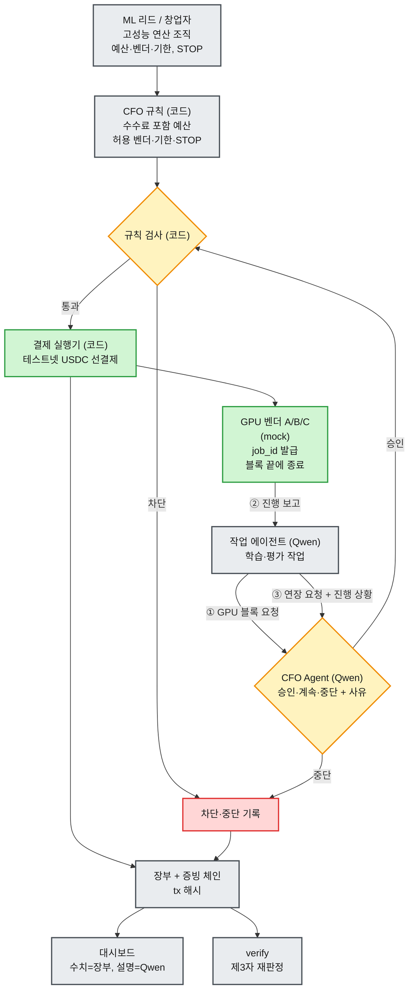

# CFO Agent — GPU Marketplace

> **Team 404 Found** · GWDC 2026 Korea Hackathon · FuriosaAI × Bricksum *Agent Finance Bonus Track*
> 상태: 아이디어 확정 단계 (2026-09-28 킥오프). 구현 전.

AI 에이전트가 GPU를 스스로 빌리는 시대에, **에이전트의 컴퓨트 지출을 승인·차단하고 그 근거를 누구나 검증할 수 있게 남기는 CFO Agent**.

## 선언문 (README 제출용 초안)

- **KO:** CFO Agent는 AI 스타트업 연구 에이전트의 GPU 임대 지출을 통제하고 증빙하는 도구다. Kiln(Qwen3-32B)이 각 임대 요청을 심사하고, 창업자가 정한 규칙(수수료 포함 예산·허용 벤더·기한·STOP)을 통과한 요청만 테스트넷 USDC로 결제되며, 모든 승인·차단·결제는 제3자가 기록만으로 검증할 수 있게 남는다.
- **EN:** CFO Agent is a spending-control and evidence tool for an AI startup's GPU-renting research agents: Qwen3-32B on Kiln reviews each rental, testnet USDC moves only when the founder's rules (fee-inclusive budget, vendor allowlist, deadline, STOP) also pass, and every approval, block and payment is recorded so a third party can verify it from the records alone.

## 문제

- 연구 에이전트는 이미 API/MCP로 GPU를 직접 띄운다. RunPod 공식 MCP로 Pod 생성이 되고([RunPod](https://www.runpod.io/blog/manage-your-runpod-infrastructure-from-any-ai-assistant-introducing-the-runpod-mcp-server)), io.net Agent Cloud는 x402·USDC로 GPU 임대 결제를 받는다([io.net](https://io.net/docs/guides/clouds/agent-cloud)). 두 곳 모두 에이전트 단위 지출 통제는 없다.
- 벤더마다 한도가 따로 있다(RunPod 기본 $80/h, Modal 월 예산). "어젯밤 에이전트들이 쓴 돈이 내가 허락한 범위였나"를 한 장부로 답할 수 없다.
- 에이전트의 지출은 구매만이 아니다. Uber는 코딩 에이전트 토큰 비용으로 연간 AI 예산을 4개월 만에 소진했다([Fortune](https://fortune.com/2026/05/26/uber-coo-ai-spending-tokens-claude-code/)).

## 작동 흐름

- **블록 단위 대화 루프:** GPU는 시간 블록 단위로 빌린다. 블록이 끝날 때마다 작업 에이전트가 진행 상황(mock 벤더가 만든 학습 로그)을 보고하고 연장을 요청하면, CFO Agent가 계속할지 멈출지 판단한다. 대화는 블록 경계에서만 한다.
- **결제 금액:** 블록마다 `시간당 단가 × 블록 시간 × (1 + 수수료)`를 선결제한다. 시간 단위 과금은 만들지 않는다.
- **벤더:** 실제 마켓 연동 없이 테스트넷 주소를 가진 mock 벤더 2~3곳과 가격표 JSON 하나로 구성한다.
- **데모 시나리오:** 정상 작업(연장 → 결제 tx 여러 건), 정체된 작업(Qwen이 중단), 폭주한 작업(수수료 포함 예산 초과 연장을 코드가 차단), 창업자 STOP.
- 편집 가능한 원본: `diagrams/gpu-marketplace-cfo-agent.excalidraw` (excalidraw.com에서 열기)

## AI와 코드의 역할

| 담당 | 하는 일 |
|---|---|
| **Qwen3-32B (Kiln)** | 작업 목표를 GPU 블록 요청으로 변환, 진행 보고와 연장 요청, CFO Agent의 승인·계속·중단 판단과 사유, 차단 사유·영수증·대시보드 요약 문장 |
| **코드** | 가격·수수료 계산, 정책 검사, 장부의 모든 수치, 결제, 해시 체인, 검증 도구 |

## 차별점

1. **블록 단위 감독 루프:** 결제가 끝이 아니라, GPU를 쓰는 동안 블록마다 "계속할 가치가 있나"를 판단해 멈춘다. 조사한 B 팀 중 진행 중인 지출을 감독하는 곳은 없다.
2. **"생각도 지출이다":** GPU 임대비와 Kiln 추론비(`usage.cost`, CFO Agent 자신의 비용 포함)를 한 예산·한 장부로 묶는다. 추론 1회 비용은 약 $0.00014(다른 팀 실측)라 절감 서사가 아니라 **통제자 자신도 같은 한도 안에서 감사받는다(루프 폭주 방지)**는 서사로 쓴다. Control Memory는 추론 호출 횟수 상한만 두고 비용을 지출 예산에 합치지는 않는다.
3. **우리 서버 없이 재판정:** 기록 묶음과 공개 RPC만으로 정책 판정을 다시 계산한다. 정상이면 통과, 한 바이트라도 조작하면 실패한다.
4. **효율:** 명백한 건은 코드가 LLM 호출 없이 판정한다. "모든 단계를 LLM이 보는 방식" 대비 토큰 절감을 실측한다.
5. **FOCUS 장부:** 리드의 IBM FinOps 경험(국내 클라우드 요금 데이터의 FOCUS 변환)을 살려 여러 벤더 비용을 한 형식으로 기록한다.

## 과제 요구사항 대응

| 요구사항 | 증거물 |
|---|---|
| 사용자·문제·AI/코드 분리 | 이 README, 역할 표 |
| Kiln 실호출 + 결정에 반영 | Qwen 응답이 승인/거절로 이어지는 로그 |
| 흐름별 토큰 | `call_kiln(flow)` 래퍼가 남기는 JSONL → 흐름별 표 |
| 에너지 추정 | 출력 토큰 × 1.63 J (가정·범위 명시, 아래 참고) |
| 테스트넷 tx | 결제·결정 기록 tx 해시 ↔ 로그 항목 매칭 |
| 범위 밖 차단 2회 이상 | 수수료 포함 예산 초과, 허용 안 된 벤더, 기한 경과, STOP |
| 조건 변경 재실행 2회 (A) | 예산 축소, 벤더 허용 취소 |
| 제3자 검증 | `verify` 실행: 정상 PASS, 조작 FAIL |

**에너지 가정:** Furiosa 공개 벤치마크(2026-04-02)에서 RNGD 서버 3 kW ÷ (46명 × 40 tok/s) ≈ **1.63 J/출력 토큰**을 쓴다. 같은 조건의 RTX Pro 6000은 4.02 J이고, 불확실성 범위는 0.48~11.9 J다. 정격 전력 기준이고 PUE는 제외한다. Kiln의 실제 서빙 구성은 공개되지 않았다. ([출처](https://furiosa.ai/blog/rngd-rtx-pro-6000-real-world-efficiency-benchmark-qwen3))

## 결정 사항과 미결정 사항

| 항목 | 상태 |
|---|---|
| 트랙 | ✅ FuriosaAI × Bricksum |
| 컨셉 | ✅ GPU Marketplace 버전 |
| CFO Agent 두뇌 | ✅ Qwen3-32B (Kiln) |
| 차단 사유·대시보드 문장 | ✅ Qwen이 작성 |
| 제출 과제 | ⏳ 분석 결과 **B 권장**(가중 점수 B 76 : A 63, 격차는 뚜렷하지만 크지 않음). 팀원은 A 선호. 팀 합의 필요 |
| 승인 방식 | ✅ CFO Agent(Qwen)가 블록마다 작업 에이전트와 대화하며 승인·계속·중단 판단 |
| 코드 규칙 검사 병행 | ⏳ **Qwen 승인 AND 코드 규칙 통과** 권장. Qwen 단독 승인이면 A·B 모두 요건 미충족으로 판정됨 |
| 대시보드 수치 출처 | ⏳ 수치는 코드 장부, Qwen은 설명문만 권장 |
| 페르소나 | ✅ GPU를 빌릴 만큼 고성능 연산이 필요한 조직 (예: AI 스타트업) |
| 벤더 결제 방식 | ✅ mock 벤더 + 코드 결제 실행기 (테스트넷 USDC 선결제) |
| 체인 | ⏳ Base Sepolia 권장 |
| 온체인 강제 (컨트랙트) | ⏳ Solidity 가능자 여부에 따라 결정 |

## 주의 사항

- **Kiln:** 모델 ID는 `qwen3-32b`다. 다른 팀 실행 기록에서 도구 호출 성공이 확인됐다(`finish_reason: tool_calls`, 760토큰, $0.00014). 도구 호출은 `auto`만 되고, `response_format`을 쓰면 빈 응답이 온다. 이메일 인증과 계정 승인 전에는 키를 만들 수 없다. 한도는 조직당 분당 60회, 동시 8개다.
- **모델 공지:** 과제 원문은 `gpt-oss-120b`지만 공식 Q&A에서 Qwen3-32B로 바뀌었다. 운영진 공지를 캡처해 둘 것.
- **발표 문구:** "실제 GPU 마켓(io.net, Akash)은 메인넷에서 온체인 결제를 한다. 우리는 그 앞단의 권한과 증빙을 테스트넷에서 재현했다." "실제 GPU 마켓에 연동했다"고 말하지 않는다.
- **비밀키:** Kiln 키(`sk-bk-`)와 테스트넷 개인키는 커밋 금지. `.env.example`만 둔다.

## 같은 트랙 공개 레포 (2026-09-28 기준)

| 팀 | 과제 | 요약 |
|---|---|---|
| [KillSwitch Wallet](https://github.com/rectinajh/killswitch-wallet) | B | 컨트랙트가 예산·허용 목록·기한·동결을 온체인 강제 |
| [Control Memory](https://github.com/him55710-sudo/Furiosa-x-bricksum) | B | API 크레딧 구매 위임. 서명 견적 판매자 시뮬레이터 3곳, 독립 검증기, 추론 호출 상한 (설계 단계, Kiln 실호출 성공) |
| [waytoweb4-agent](https://github.com/leafjava/waytoweb4-Agent) | A | 카피트레이딩 위임. 흐름별 토큰·에너지, 증거 검증기 |
| [PolicyGuard](https://github.com/heheboi1972/hackathon-seoul-2026) | A | 쇼핑 구매 에이전트 (문서만) |

컴퓨트·GPU 조달을 다루는 팀은 찾지 못했다. 트랙 전체의 일부만 조사한 결과다. Top 3를 A·B 합산으로 뽑는지 과제별로 뽑는지는 공식 Q&A 채널에서 확인이 필요하다.

## 레포 구성

- `diagrams/`: 아키텍처 다이어그램. `gpu-marketplace-cfo-agent.*`가 현재 버전, `cfo-agent-architecture.*`는 초기 Multi-API 버전
- `md/`: 트랙 설명 노트
- `pdf/`: 공식 참가 안내서
