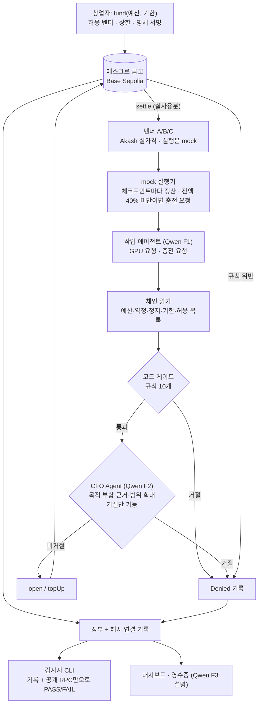

# CFO Agent — GPU 지출을 충전식으로 감독하는 에스크로 금고

> **Team 404 Found** · GWDC 2026 Korea Hackathon · FuriosaAI × Bricksum *Agent Finance Bonus Track*
> 제출 과제: **Challenge B** (권장안, 팀 확정은 9/29 01:00 KST) · 상태: 설계 승인, 구현 전
> 설계 문서: [`docs/designs/cfo-agent-escrow-topup.md`](docs/designs/cfo-agent-escrow-topup.md) · 금고 설명: [`docs/escrow-vault.md`](docs/escrow-vault.md)

## 기능 선언 (한 문장)

- **KO:** CFO Agent는 GPU를 빌리는 AI 에이전트의 지출을 작업 단위 에스크로로 충전하고 감독한다. 코드 규칙과 CFO(Qwen3-32B on Kiln)의 판단을 모두 통과한 지출만 테스트넷에서 정산하고, 모든 허락과 거절을 제3자가 기록만으로 다시 판정할 수 있게 남기는 통제·증빙 레이어다.
- **EN:** CFO Agent is a control-and-evidence layer that funds and supervises a GPU-renting AI agent's spending through a per-job escrow with top-ups, settles on testnet only what passes both code rules and a CFO review by Qwen3-32B on Kiln, and records every approval and denial so a third party can re-judge it from the records alone.

## 사용자와 문제

- **사용자:** GPU를 빌려 쓸 만큼 고성능 연산이 필요한 조직(예: AI 스타트업)의 ML 리드나 창업자. 이들은 연구·평가 에이전트에게 GPU 예산을 맡긴다.
- **문제:**
  - 에이전트는 이미 API로 GPU를 직접 띄운다. RunPod 공식 MCP로 Pod를 만들 수 있고([RunPod](https://www.runpod.io/blog/manage-your-runpod-infrastructure-from-any-ai-assistant-introducing-the-runpod-mcp-server)), io.net Agent Cloud는 x402·USDC로 GPU 임대 결제를 받는다([io.net](https://io.net/docs/guides/clouds/agent-cloud)).
  - 하지만 에이전트 단위로 "얼마까지, 어느 벤더에, 언제까지"를 강제하고, 그 허락을 나중에 검증할 방법이 없다.
  - 결제 레일에는 누가 누구에게 냈는지만 남는다. 누가 어떤 조건으로 허락했는지는 남지 않는다.
- **우리의 답:** 결제 한 건을 막는 데서 끝나지 않는다. **돈이 나가는 도중에** 충전할 가치가 있는지 심사한다. 규칙은 통과했지만 목적을 벗어난 충전은 CFO가 거절한다.

## 작동 흐름

1. 창업자가 예산과 기한을 넣고(`fund`), 허용 벤더와 호출당 상한을 정하고, 작업 명세(목적·허용 GPU·작업 상한·기한)에 서명한다.
2. 작업 에이전트가 GPU를 요청한다. 코드 게이트가 규칙을 먼저 판정하고, 통과한 요청만 CFO Qwen이 목적에 비추어 판단한다. 둘 다 통과해야 `open`으로 hold를 잡는다.
3. GPU 작업은 끊기지 않고 진행된다. 체크포인트마다 실사용분을 `settle`한다.
4. 잔액이 hold의 40% 밑으로 떨어지면 에이전트가 진행 상황과 근거를 붙여 **충전을 요청**한다. 같은 심사를 거쳐 `topUp`한다.
5. STOP, 기한 경과, 규칙 위반은 돈을 움직이지 않고 `Denied`로 기록된다. 끝나면 `close`하고, 남은 예산은 `refund`로 돌려받는다.
6. 누구든 감사자 CLI로 기록과 체인만 보고 "허락된 범위 안이었나"를 다시 판정할 수 있다.

**사용 가능한 결과물:** 통제된 GPU 지출, 작업별 영수증, 제3자가 검증할 수 있는 기록 묶음.

## AI · 코드 · 컨트랙트의 역할

| 담당 | 하는 일 | 하지 않는 일 |
|---|---|---|
| **Qwen3-32B (Kiln)** | F1 요청 작성(벤더·GPU·금액·근거), F2 CFO 심사(목적 부합, 근거 타당성, 범위 확대 여부 판단과 사유 작성), F3 영수증 설명 | 금액 결정, 서명, 규칙 완화. **거절만 할 수 있다** |
| **코드 (백엔드)** | 체인 읽기, 게이트 규칙 10개, 금액·수수료 계산, 서명·전송, 장부와 해시 체인, fail-closed 처리 | 목적 판단 |
| **컨트랙트 (금고)** | 허용 벤더·예산(수수료 포함)·호출당 상한·기한·STOP의 **최종 강제**, 위반 시 `Denied` 기록 | 판단 |

## 경계와 강제 위치

> **경계:** 창업자 금고에서 나가는 돈은 네 조건을 모두 만족해야 한다. ① 허용된 벤더에게, ② 수수료를 포함해 남은 예산 안에서, ③ 호출당 상한(`maxHold`) 이하로, ④ 기한 전이고 STOP이 아닐 때. 그리고 코드 게이트와 CFO 판단을 모두 통과해야 한다.

| 층 | 위치 | 막는 것 | 우회되면 |
|---|---|---|---|
| 1. 코드 게이트 | `backend/gate` `check()` *(구현 예정)* | 규칙 10개 (아래 표) | 2·3층이 남음 |
| 2. CFO Qwen | `backend/agents` F2 *(구현 예정)* | 목적 이탈, 근거 부족, 범위 확대 | 1·3층이 남음 |
| 3. 금고 컨트랙트 | `contracts/AgentBudgetVault.sol` `_agentChecks` 계열 *(구현 예정)* | 벤더·예산·상한·기한·STOP | **최종선.** 탈취된 키도 여기서 막힘 |

**범위 밖 실행 (데모에서 보여줄 4가지):** 수수료를 더하면 예산 초과, 허용 안 된 벤더, 기한 경과, STOP. 각각 게이트 기록과 체인의 `Denied` 이벤트로 남는다. 멈춤은 조용히 넘어가지 않고 기록된다.

**게이트 규칙:**
- 체인에서 확인하는 것: `VENDOR_NOT_ALLOWED`, `OVER_BUDGET_WITH_FEE`, `OVER_MAX_HOLD`, `PAST_DEADLINE`, `PAUSED`
- 서명된 명세로 확인하는 것: `GPU_TYPE_NOT_ALLOWED`, `OVER_JOB_CAP`
- 시장 데이터로 확인하는 것: `NO_CAPACITY` (Akash 가용 수량)
- 실행 로그로 확인하는 것: `LOSS_PLATEAU`, `NAN_DETECTED`
- Qwen 결과: `QWEN_DENIED`, `QWEN_UNAVAILABLE`, `QWEN_UNPARSEABLE`. Qwen이 실패하면 거절로 처리한다(fail-closed).

## 체인에서 읽고, 쓰고, 정산하는 것

| 구분 | 대상 |
|---|---|
| **읽기** | 요청 직전 `eth_call`: `budget`, `committed`, `paused`, `deadline`, `vendorAllowed`, `maxHold`, `jobs[id]`. 읽은 값과 블록 번호를 기록에 넣고, 기록의 해시가 tx에 고정된다 |
| **쓰기** | `open`/`topUp`(hold 예약), `recordDecision`/`Denied`(거절 기록), `setPaused`(STOP), `setVendor`, `setMaxHold` |
| **정산** | `settle`(벤더에게 실사용분 지급 + 수수료 3%), 추론비 작업 정산(INFERENCE, 수수료 없음), `refund`(미약정 잔액 반환) |

**tx와 기록 매칭:** 창업자와 백엔드가 보낸 모든 tx는 기록 파일 하나와 1:1로 대응한다. 표는 구현 후 Basescan 링크로 채운다.

| # | 함수 | tx 해시 | 기록 파일 | 결과 |
|---|---|---|---|---|
| — | *(데모 실행 후 채움)* | | | |

## Kiln 사용과 효율

| 흐름 | 언제 | 입력 → 출력 |
|---|---|---|
| F1 `work_request` | 작업 시작, 충전 트리거 | 명세 + 진행 로그 → 요청 JSON |
| F2 `cfo_review` | 게이트 통과 후에만 | 명세 + 요청 → `{verdict, reason}` |
| F3 `receipt_explain` | 작업 종료 | 작업 기록 → 영수증 설명 |

- **실호출 증거:** 원문 응답, `usage`, generation id를 JSONL로 남긴다. 흐름별 호출 수, 토큰, 비용, 에너지 표는 스크립트로 자동 생성한다.
- **불필요한 추론 줄이기:**
  - 숫자로 판단할 수 있는 건 코드가 판단한다.
  - 게이트가 먼저 거절하면 F2를 호출하지 않는다. 그렇게 줄인 호출 수를 센다.
  - `/no_think`를 기본으로 켠다. 켰을 때와 껐을 때를 비교한다.
- **에너지 추정:** `E = Σ 출력 토큰 × 1.63 J`
  - 근거: [Furiosa 블로그 2026-04-02](https://furiosa.ai/blog/rngd-rtx-pro-6000-real-world-efficiency-benchmark-qwen3). RNGD 8장 서버 3 kW ÷ (46명 × 40 tok/s). 같은 조건에서 RTX Pro 6000은 4.02 J이다.
  - 가정: 정격 전력, 전부하, PUE 제외, prefill(입력) 토큰 제외.
  - 참고 상한: 배칭 없이 RNGD 4장(각 180W)을 쓴다고 보면 720W ÷ 60.6 tok/s ≈ 11.9 J이다.
- **모델:** 과제 문서에는 `gpt-oss-120b`로 적혀 있다. 하지만 공식 Q&A에서 **Qwen3-32B로 변경**되었다(공지 캡처는 `docs/`에 추가 예정).

## 벤더와 가격

- 벤더 A/B/C는 팀이 만든 테스트넷 주소다. 각 주소에 **Akash 실제 H100 제공자 한 곳**의 가격을 붙인다(예: $2.04 / $2.56 / $3.16 per GPU-hour).
- 가격 출처는 [Akash Console API](https://console-api.akash.network/v1/gpu-prices)다. 최근 31일 온체인 입찰을 기반으로 한 추정치이며, 스냅샷을 fallback으로 둔다.
- **GPU 실행은 시뮬레이션이다.** 데모는 60배속 시계로 돌린다. 실제 GPU 마켓과 연동하지 않았다.

## 제3자 재판정 (감사자 CLI)

기록 묶음, 금고 주소, 공개 RPC만 있으면 다음을 검사한다.
- 기록 해시 체인이 이어지는가
- 명세 서명자가 금고의 `founder`인가
- 모든 hold와 충전 앞에 게이트 통과 기록과 CFO 비거절 기록이 있는가
- 게이트 규칙을 다시 계산하면 같은 판정이 나오는가
- 지급 벤더가 허용 목록에 있었는가
- 예산과 수수료가 맞는가
- 기한이 지나거나 STOP된 뒤에 지출이 없었는가
- `Denied` 기록이 모두 남아 있는가

정상 묶음이면 **PASS**, 기록을 1바이트라도 변조하면 **FAIL**이 나온다. 재현 명령은 구현 후 추가한다.

## 알려진 한계

- 정산 금액은 우리 장부가 신고한 값이다. 체인은 실제 GPU 사용량을 검증하지 않는다.
- Qwen의 판단 기록은 백엔드가 스스로 증명한 값이다(Kiln 서명 없음). 결정적 규칙은 감사자가 다시 계산한다.
- 에이전트 키를 탈취당하면, 남은 예산 안에서 허용 벤더에게 호출당 `maxHold`씩 보낼 수 있다. 이런 시도는 모두 기록된다.
- gas(ETH)는 USDC 예산 한도 밖이다.
- 벤더 가격은 추정치이고, 실행은 mock이다.

## 현재 상태와 레포 구성

- **완료:** 설계 승인(spec review 3회), 금고 컨트랙트 초안 작성(감사 받지 않음, 레포 미포함).
- **다음:** Kiln 키 확인, Base Sepolia 배포, 금고 수정, 게이트·장부, 실행기, 감사자 CLI, 대시보드.
- `docs/designs/`: 승인된 설계 문서
- `docs/escrow-vault.md`: 에스크로 금고를 쉽게 풀어 쓴 설명
- `diagrams/`: 이전 단계 다이어그램(블록 방식과 초기 Multi-API 버전). 현재 흐름은 위의 mermaid 다이어그램이 기준이다.
- `md/`, `pdf/`: 트랙 노트, 공식 참가 안내서

## 비밀 정보

Kiln 키(`sk-bk-`)와 테스트넷 개인키는 커밋하지 않는다. `.env.example`만 둔다.
